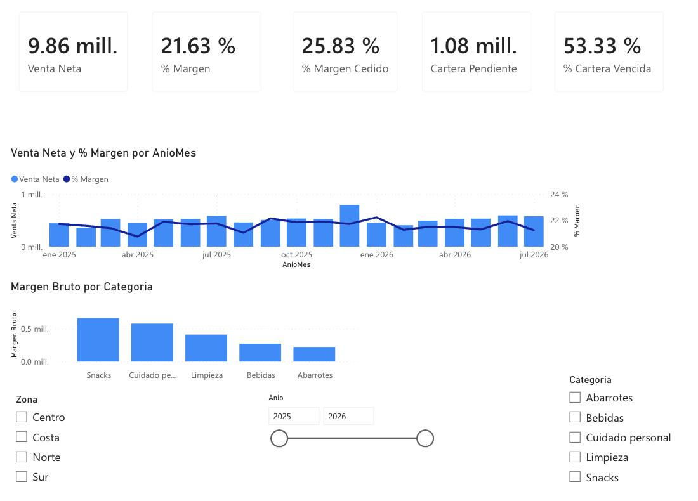
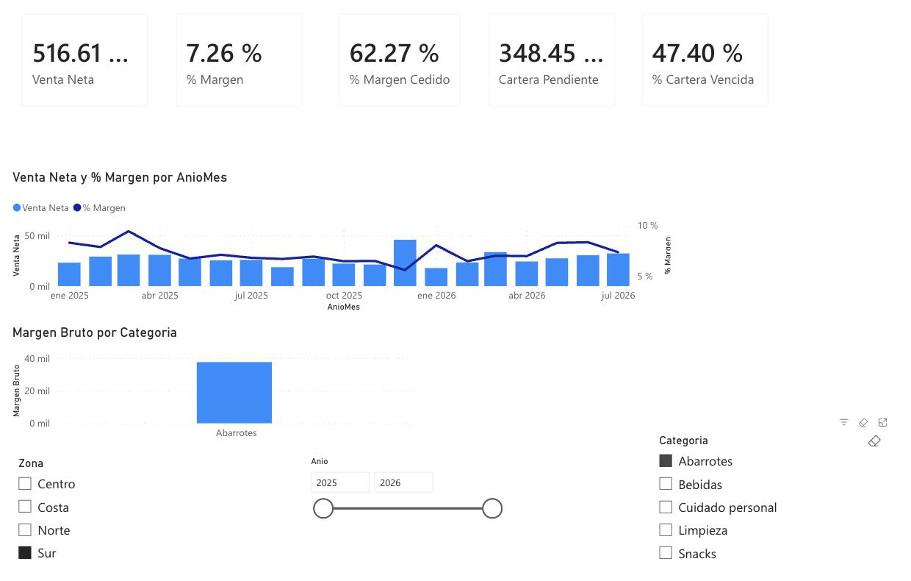
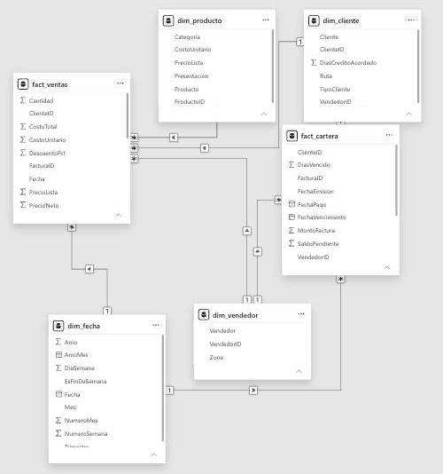

# 📊 Control Comercial — Tablero de Power BI

**Informe en vivo:** [abrir en Power BI](https://app.powerbi.com/view?r=eyJrIjoiMDFkYjg2MTMtOGEzZC00NzRkLWJiNzctNzU2YmE4NjNjNDExIiwidCI6IjMzYjVjZjE3LTU3NjktNDQ1Ny1iYTYzLTZjMjY0ODFkMjU5MCIsImMiOjR9) · **Página del proyecto:** https://byronbustamanteg700.github.io/powerbi-control-comercial/

Tablero ejecutivo para un distribuidor mayorista, construido de principio a fin en Power BI: modelo de datos en estrella, medidas DAX e informe interactivo. Está diseñado para responder una pregunta: **¿dónde se está yendo el margen?**

> Proyecto de portafolio con **datos simulados**. No contiene información de ningún cliente.



## Lo que muestra el tablero

| Indicador | Valor |
|---|---|
| Venta neta | 9,86 millones |
| % Margen | 21,63 % |
| % Margen cedido en descuentos | 25,83 % |
| Cartera pendiente | 1,08 millones |
| % Cartera vencida | 53,33 % |

**Hallazgos:**

- **Una cuarta parte del margen posible se entrega en descuentos.** El costo del producto no baja cuando el vendedor descuenta, así que cada dólar de descuento sale íntegro del margen: se cede el 25,8 % del margen que se habría obtenido a precio de lista.
- **Vender más no mejora el margen.** Entre enero y julio, la venta de 2026 supera a la de 2025 en 5,1 %, pero el margen se queda en 21,6 % y la proporción cedida en descuentos sube de 25,8 % a 26,2 %.
- **El caso más grave aparece al filtrar una zona y una categoría.** En Zona Sur + Abarrotes el margen cae a 7,26 % y se cede el 62,3 % del margen potencial: se regaló más margen (≈ 61,9 mil) del que se retuvo (≈ 37,5 mil).
- **Más de la mitad de la cartera está vencida** (53,3 %).



El tablero no produce esas conclusiones: hace que se encuentren en segundos.

## Modelo de datos

Modelo estrella con 6 tablas y 7 relaciones, todas de varios a uno, en una sola dirección y sin relaciones entre dimensiones ni entre tablas de hechos.

| Tabla | Tipo | Filas |
|---|---|---|
| `fact_ventas` | Hechos — líneas de venta | 25.680 |
| `fact_cartera` | Hechos — facturas por cobrar | 6.528 |
| `dim_fecha` | Dimensión — calendario ene 2025 a jul 2026 | 577 |
| `dim_producto` | Dimensión — 5 categorías | 96 |
| `dim_cliente` | Dimensión — rutas y días de crédito | 140 |
| `dim_vendedor` | Dimensión — 4 zonas | 8 |



**Detalle de diseño:** la categoría de producto filtra las ventas pero no la cartera, porque una factura mezcla productos de varias categorías. Al filtrar por categoría, los indicadores de cartera no cambian, y es lo correcto.

## Medidas DAX

14 medidas: 9 sobre ventas y margen, y 5 sobre cartera. La que diferencia este tablero es `% Margen Cedido`:

```dax
Margen Potencial = [Venta Bruta] - [Costo]
% Margen Cedido  = DIVIDE([Descuento Otorgado], [Margen Potencial])
```

El código completo, con la explicación de cada medida, está en [`docs/medidas-dax.md`](docs/medidas-dax.md).

## Estructura del repositorio

```
├── index.html               → página del proyecto (GitHub Pages)
├── datos/
│   └── distribucion-demo.xlsx → las 6 tablas, declaradas como tablas de Excel
└── docs/
    ├── medidas-dax.md       → las 14 medidas DAX
    └── capturas/            → vista general, filtro Zona Sur + Abarrotes y modelo
```

## Cómo reproducirlo

1. Cargar `datos/distribucion-demo.xlsx` en Power BI y seleccionar las 6 tablas.
2. Tipar como **Fecha** las columnas de fecha (`dim_fecha[Fecha]`, `fact_ventas[Fecha]`, `fact_cartera[FechaEmision]`, `[FechaVencimiento]` y `[FechaPago]`).
3. Crear las 7 relaciones del modelo estrella (las tablas de hechos apuntan a las dimensiones por su ID; las fechas, a `dim_fecha[Fecha]`).
4. Crear las medidas de `docs/medidas-dax.md` en el orden indicado.

**Herramientas:** Power BI (servicio web), Power Query, DAX y Excel.

---

### 🇬🇧 English summary

Executive Power BI dashboard for a wholesale distributor, built end to end: a star-schema model (6 tables, 7 one-way many-to-one relationships, ~26,000 sales lines over 19 months), 14 DAX measures for margin, discounts and receivables aging, and an interactive report with cross-filtering slicers. Key findings: 25.8% of potential margin is conceded in discounts; sales grew 5.1% year over year (Jan–Jul) with no margin improvement; filtering South zone + Staples exposes a 7.3% margin with 62% of potential margin given away; over half of receivables are past due. **Simulated data — no client information.**

## Autor

Byron Bustamante — economista. [Otros proyectos](https://github.com/byronbustamanteg700)
